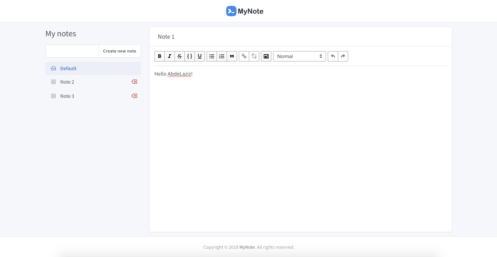

# React App Note

A Simple Notes App

## Demo

## Dependencies

This project was bootstrapped with [Create React App](https://github.com/facebook/create-react-app).

- [react] - React is a JavaScript library for building user interfaces. version: 16.3.2
- [react-dom] - React package for working with the DOM. version: 16.3.2
- [react-rte] - React Rich Text Editor version: 0.16.1

## License

[MIT](https://choosealicense.com/licenses/mit/) © [ABDELAZIZ EL ARASSI](https://www.linkedin.com/in/aelarassi/)

[react]: https://reactjs.org/
[react-dom]: https://reactjs.org/
[react-rte]: https://github.com/sstur/react-rte#readme
